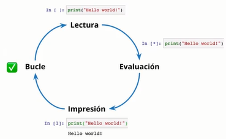

# ENTORNO DE TRABAJO CON JUPYTER NOTEBOOKS Y ANACONDA

[Version en notion](https://www.notion.so/AN-LISIS-DE-NEGOCIOS-PARA-CIENCIA-DE-DATOS-4b2a82bc347f4f89beb4d07f844c2332) 

## GLOSARIO

Canales: el lugar donde están almacenados los paquetes.

Revisión: es el estado de tu ambiente. Cada vez que tu actualizas una librería se crea una nueva revisión; esto quiere decir que puedes llevar un tracking o un seguimiento de todo lo que estás haciendo con tu ambiente.

Env: Enviroment o ambiente.

## INTRODUCCIÓN

### ¿En qué lugares programar en ciencia de datos?

A través de:

- Tu navegador
- De forma local a través de un editor de código o un IDE
- De una conexión al servidor de tu empresa
- En tu celular

Y lo podemos hacer en cualquier sistema operativo, no obstante, los científicos de datos prefieren trabajar en un sistema operativo basado en Linux o en UNIX (como Ubuntu o MacOS) pues te permite realizar ejecuciones en la línea de comandos de una manera muy sencilla.

Existe un componente clave que se comparte entre todas las herramientas (VSCode, Jupyter, Deepnote, SSH, CO, etc): los Notebooks.

### Notebooks

En 2001 el Físico Colombiano Fernando Pérez comenzó a trabajar en el desarrollo de IPython, una herramienta que ampliaba la funcionalidad del REPL (Read Evaluate Print Loop: Lectura, Evaluación, Impresión, Bucle) por defecto de Python.



Entre las funciones que añade IPython se encuentra:

- Resaltado de línea y errores mediante colores
- Sintaxis especial para la línea de comandos
- Autocomplementado de variables y módulos
- Y mucho más.

Con esto, crear código se convirtió en algo mucho más dinámico: un ciclo de prueba, observa y repite.

Con el tiempo esto se volvió muy popular y dio origen a lo que conocemos ahora como Jupyter Notebooks, una herramienta que te permite tener todas las funcionalidades de IPython con texto enriquecido (negrita,cursiva, imagenes, gif, etc), haciendo que documentar tus análisis sea mucho más sencillo pues te permitía explicar las ideas fundamentales de tu código, poner gifs para explicar mejor tu modelo, etc.

### Notebooks en la nube VS locales

- Ambos son útiles
- Confinguración de entorno: en la nube tienes todo lo necesario para comenzar a trabajar en ciencia de datos. En forma local tenemos que configurarlo manualmente.
- Tiempos de ejecución: los ambientes en la nube son muy buenos porque siempre se puede ampliar la capacidad para trabajar.
- Escalabilidad.

## GOOGLE COLAB

O simplemente Colab. Es un sistema basado en Jupyter Notebook que te ayuda a trabajar en ciencia de datos que viven dentro de tu cuenta de Google Drive (es un servicio en la nube). No requiere configuración, además, su filosofía de trabajo es a nivel de archivo (el punto inicial de tu proyecto va a ser el Notebook).

El trabajo a nivel de archivo hace referencia a que un único notebook es la entrada a nuestro proyecto. El trabajo a nivel de proyecto nos indica que tenemos múltiples puntos de entrada al proyecto.

Google Colab te provee de una opción que son el uso gratuito de GPUs y TPUs, que son características que te otorgan poder de computo y ejecución para cuando tienes modelos muy grandes.

### Como entrar a Google Colab y primeros pasos:

1. Vamos a Google Drive > Nuevo > Google Colaboratory.
- No tienes que configurar nada.
- Si no aparece en la opciones podemos buscarla dando en Conectar con más aplicaciones.
1. Clic en Conectar. Cuando aparezca el chulo significa que estás listo para comenzar a trabajar.
- Para ejecutar la celda solo debemos darle en el boton de Play o presionar Comand + Ctrl + Enter.
- Google Colab funciona con Python, es decir que cualquier sentencia de Python válida que escribamos en la celda se va a ejecutar (Python puro).
- Hay 2 tipos de celdas a ejecutar:
    - Celdas de código: como operaciones matemáticas.
    - Celdas de texto: texto enriquecido. Para utilizarlo necesitas saber Markdown, aunque arriba del bloque de texto hay varias opciones.
- Las variables persisten a través de celdas de código.
- Para llamar a la línea de comandos se tiene que usar un operador especial (!) seguido de un comando válido de la línea de comandos.
- Una librería es una colección de funciones que buscan serolver un problema. Para descargar liberías:
    
    ```python
    !pip install *Nombre_de_libreria*
    ```
    
    Y le damos en ejecutar
    
    - Para usar la librería que descargamos:
    
    ```python
    import *Nombre_de_libreria*
    ```
    
    Y le damos en ejecutar.
    

### Google Colab y sus funciones para científicos de datos

- Subir datos: Barra lateral > Clic en ícono de carpeta > arrastramos el archivo que queramos subir. Esta forma es temporal y el archivo no lo podremos volver a utilizar cuando pasen ciertas horas sin usar el Notebook.
    - Después de subir el archivo le damos doble clic y automáticamente google Colab te muestra una vista previa donde podemos explorar los datos.
- Otra forma de subir datos de forma permanente: lo podemos conectar a nuestra cuenta de Google Drive.
- Google Colab ya viene con muchas librerías que podemos usar para trabajar ciencia de datos, por ejemplo:
    - 📊 **matplotlib**: Generación de gráficos a partir de listas o arrays.
    - 🧑‍💻 **numpy**: Cómputo científico para la manipulación de vectores.
    - 🧑‍💻 **pandas**: Manipulación y análisis de datos de tablas y series temporales.
    - 🧑‍💻 **scipy**: Herramientas y algoritmos matemáticos.
    - 📊 **seaborn**: Visualización de datos estadísticos.
    
    ```python
    import matplotlib.pyplot as plt
    import numpy as np
    import pandas as pd
    import scipy as sc
    import seaborn as sns
    ```
    
- Podemos generar gráficas
    
    
    
- Google Colab tiene una sección de código ya escrito que se puede usar, para ello nos vamos a la barra lateral de la izquierda donde dice Code Snippes o Fragmentos de código  > le damos clic > buscamos el código que queramos.
- Los atajo de teclado son muy útiles porque hará que trabajes mucho más rápido. Es recomendable usar la paleta de comandos. Para acceder a ella le damos clic a este ícono en el menú de la izquierda (o Ctrl + Shift + P).
    
    
    
    - Para acceder a los atajos del teclado entramos a la paleta de comandos y escribimos combinaciones de teclas o atajos del teclado o Shortcuts.

## DEEPNOTE

Es un servicio en la nube basado en Jupyter Notebooks.

- No requiere configuración adicional para comenzar a trabajar
- Su filosofía está enfocada más a nivel de proyecto. Se va a sentir mucho más natural al momento de trabajar.
- Te permite la colaboración en tiempo real.
- Permite integración con múltiples aplicaciones. Por ejemplo, se puede conectar a Google Drive, a una base de datos, etc.
- Una de las características que más se aprecia para los científicos de datos en Deepnote es la utilización de una terminal integrada o línea de comandos, y provee una interfaz tan buena que podrás hacer ciencia de datos sin ningún problema.
- Permite almacenar variables de entorno, como contraseñas
- Provee una herramienta muy poderosa, que es poder publicar tus proyectos (construir portafolio).

### Cómo usar:

1. Entramos a [deepnote.com](http://deepnote.com) 
2. Projects > New Project
- Deepnote puede ejecutar las mismas cosas que Google Colab.
- Revisar el archivo en Deepnote llamado Introducción a Deepnote para ver las múltiples funciones (ojo! está desactualizado).
- Deepnote tiene más opciones que Google Colab (código y texto): tiene añadir código y añadir bloque (parecido a Notion)
    
    
    
- Hay un tipo de celda que podemos agregar llamada Chart. Elegimos un dataframe (dataframe es un archivo de columnas) y podemos jugar con los datos para empezar a gráficar. Esto puede tomar algo de tiempo y debemos ver que estemos conectados; todo esto sin usar una línea de código.
- Podemos usar Deepnote como portafolio. En la parte superior derecha le damos clic a Share y podemos modificar el tipo de permisos y los colaboradores.

## EDITORES DE CÓDIGO VS IDE (entorno de desarrollo integrado o Integrated Development Environment)


### WSL y VSCode

Para abrir VSCode desde la terminal de Ubuntu (WSL) escribimos 

```powershell
code .
```

El punto significa “aquí”, es decir, le estás diciendo a VSCode que abra la siguiente carpeta.

Este comando abrirá una versión de VSCode que correrá desde WSL con el sistema operativo Ubuntu. Esto puedes comprobarlo porque en la parte inferior izquierda de tu editor verás un recuadro verde que indica que estás en WSL y qué versión de Linux utilizas:


Es recomendable activar la sincronización de extensiones automáticamente:

1. Barra lateral de extensiones > Clic en Accounts >Turn On Settings Sync 

Paleta de comandos:

1. Ctrl + Shift + P
- Format Document: para darle un formato organizado al documento.
- Sort imports: organiza las importaciones en orden alfabético. Muy importante para legibilidad.

### Jupyter Notebook

Dentro de los Jupyter Notebook (dentro de VSCode) puedes hacer uso de las extensiones, algo que no podrías hacer usando Google Colab o Deepnote

La extensión de los Jupyter notebook es .ipynb

Ayudas a tener en cuenta:

- Muestra todas las variables listadas en el código.


## AMBIENTES VIRTUALES

Tenemos una computadora que estará dividida en pequeñas partes o pequeños entornos (como tener mini computadoras) dentro de tu computadora; de esta forma cada proyecto que tengas puede estar separado. Si decidieramos actualizar el ambiente se puede hacer dirigidamente, es decir, ser muy específico, así todas los proyectos externos van a seguir funcionando pues solo estas editando en un lugar específico.


Un ambiente virtual es un proyecto que puede tener sus propias dependencias, independientemente de las dependencias que tengan los demás proyectos.

### Abrir tus notebooks desde VSCode con cualquier ambiente que hayas creado

1. Abre VSCode desde tu terminal (comando code .)
2. Abrimos un notebook vacio (.ipynb).
3. Verificamos que tengamos la extensión de Python en VSCode instalada
4. En el notebook vacío, en la parte superior derecha está el simbolo de seleccionar Kernel (ambientes), le damos clic
    
    
    
5. Elegimos el que queramos

Listo, has seleccionado un ambiente. De esta forma puedes cambiar de ambiente cuando lo necesites y abrir tus notebooks para trabajar con ellas en VSCode.

Si no aparecen los ambientes creados con conda:

- Verificamos el paso 3
- Recarga tu ventana de VSCode usando el comando Ctrl + R.

## CONDA

Conda es un programa que está diseñado para la manipulación o gestión de paquetes, dependencias y entornos para cualquier lenguaje: Python, R, Ruby, Lua, Scala, Java, JavaScript, C/C ++, FORTRAN y más.

Para instalar Conda es necesario instalar MiniConda. Miniconda es una versión mínima para que funcione conda. Entre esta dependencia también se incluye Python.

Al instalar Anaconda es una dependencia mucho más grande que incluye Miniconda. Este es un metapaquete o colección de paquetes diseñados para su uso diario en ciencia de datos.


Al instalar Anaconda desde la terminal debe aparecer “base”, esto es un indicativo que se instaló correctamente y estás en Conda (base es el ambiente base).


Conda al ser un programa que trae muchas cosas para científicos de datos trae herramientas que te van a facilitar la vida, como:

- Su propia versión de Jupyter Notebook: escribimos
    
    ```powershell
    jupyter-notebook 
    ```
    
    Abrimos el link que tenga la palabra [localhost](http://localhost) y esto nos lleva al home page de Notebook.
    
    - Para crear un nuevo Notebook le damos clic a Nuevo > Python 3 (este es el ambiente en el que queremos trabajar) y automáticamente te dirigirá a la interfaz de un Jupyter Notebook (es muy similar a la interfaz de Google Colab o Deepnote).
    - Ctrl + C cancela el proceso que tengamos en la consola.
- Al abrir VSCode y conectarlo a Conda tenemos que buscar donde diga el tipo de ambiente en el que estamos y cambiarlo al que diga base o/y conda.
    
    
    
    Así ya tendríamos ejecutando un ambiente de Conda dentro de Visual Studio Code.
    

### Crear, actualizar y eliminar ambientes en Conda

- Permite listar todos los ambientes que tengas instalados en tu computadora
    
    ```bash
    conda env list
    ```
    
    Hay un * que marca el ambiente en el que te encuentras
    


Para ver los paquetes con filtro y un poco más específico (dice la versión):

```bash
conda list *Nombre_de_ambiente*
```

- Para crear un nuevo ambiente. Si no se especifica la versión esta descarga la última versión disponible.
    
    ```bash
    conda create --name *Nombre_de_ambiente*
    ```
    
    Por ejemplo, en la siguiente imagen descargamos la versión 3.5 de python, le pusimos de nombre py35 y la última versión disponible de pandas
    


Después aparece un mensaje de como activar o desactivar el ambiente que acabas de descargar


- Para actualizar a una versión más reciente un ambiente:
    
    ```bash
    conda update *Nombre_de_ambiente* 
    ```
    
    Si ya tienes esa versión instalada te aparecerá un mensaje como este:
    


- Para actualizar a una versión en específico un ambiente:
    
    ```bash
    conda install *Nombre_de_ambiente*=*numero_version*
    ```
    
- Para renombrar un ambiente:
    
    ```bash
    conda create --name *Nuevo_nombre* --copy --clone *Nombre_anterior*
    ```
    
- Para eliminar librerías y dependencias o paquetes:
    
    ```bash
    conda remove *Nombre_de_librería*
    ```
    
- Para eliminar todo el ambiente construido:
    
    ```bash
    conda env remove --name *Nombre_de_ambiente*
    ```
    
    No podemos eliminar un ambiente si nos encontramos en este. Para eso, tenemos que cambiar de ambiente (o usamos `conda deactivate` para movernos al ambiente base)
    

### Comandos avanzados de Conda

- Para instalar un paquete especificando un canal, es decir, de qué página de internet quiero que descargue el paquete:
    
    ```bash
    conda install --channel *Nombre_del_canal* *Paquete_a_instalar*
    ```
    
- Listar las revisiones:
    
    ```bash
    conda list --revision
    ```
    
- Otra forma para desinstalar paquetes que te da mucho más poder:
    
    ```bash
    conda install --revision *Número*
    ```
    
    El número hace referencia al número de revisión en el cual aun no tenías instalado el paquete que quieres desinstalar.
    
- Para compartir (exportar) tus ambientes con otras personas
    
    ```bash
    conda env export
    ```
    
    Automáticamente conda te creará líneas de texto con información como nombre del ambiente y canales, sin embargo es mejor usarlo con alguno de los siguientes códigos para que la otra persona pueda instalarlo sin ningun problema:
    
    - Esta opción remueve el texto después del signo = para que no aparezca y solo muestre las versiones de los paquetes instalados:
    
    ```bash
    conda env export --no-builds
    ```
    
    - La otra forma lo que va a hacer es exportar aquellas dependencias que tu especificaste manualmente. Esta es la mejor manera de compartir un ambiente pues va a funcionar de una manera multiplataforma:
    
    ```bash
    conda env export --from-history
    ```
    
    Ahora el siguiente paso sería enviarlo a un archivo para que lo puedas pasar a alguien más:
    
    ```bash
    conda env export --from-history --file *Nombre_de_archivo*.yml
    ```
    
    Un nombre muy común para esos ambientes es enviroment.yml
    
- Para importar ambientes, primero tenemos que desactivar el ambiente que tenemos en el momento,  y después ejecutar el siguiente comando:
    
    ```bash
    conda env create --file *Nombre_de_archivo*.yml
    ```
    

## ACELERAR LA CREACIÓN DE AMBIENTES VIRTUALES CON MAMBA

Mamba es una reimplementación en Conda para acelerar la creación de ambientes virtuales (en C++).

Mamba te permite te permite descargar datos o resolver estas librerías dependencias para crear tu ambiente virtual en paralelo, es decir, va a buscar múltiples alternativas al mismo tiempo. También incluye muchas otras optimizaciones que harán que trabajar con el se sienta de una manera mucho más rápida y fluida.

Al mismo tiempo Mamba también incluye una interfaz de línea de comandos que funciona o trata de funcionar de la misma manera que conda, es decir, en lugar de poner “conda” en la línea de comandos ponemos “mamba” y funciona de la misma forma y con casi las mismas funciones.

### Como descargar Mamba

1. Vamos a la línea de comandos y utilizamos conda para instalarlo. Escribimos:
    
    ```bash
    conda install --channel conda-forge mamba
    ```
    
    Conda-forge es el canal donde se encuentra mamba.
    

### Divide y venceras

Hace alusión a resolver un problema muy difícil dividiendolo en partes mucho más pequeñas que se pueden resolver individualmente. Esto se puede resolver en ambientes virtuales.

En lugar de crear un solo ambiente para tu proyecto puedes crear múltiples ambientes para un proyecto, siempre dividiendolo en secciones mucho más pequeñas que te ayuden a controlar de una manera mucho más granular todo el contenido de tu trabajo.

Un paquete que implementa muy bien este concepto es Snakemake.

Snakemake es un motor de flujo de trabajo o mejor conocidos como workflows, es decir, tus etapas de proyecto basadas en Python divididas en pasos, donde Snakemake se va a encargar de ejecutar cada paso con un ambiente en específico de forma automática.

## CONCLUSIONES

- Escoger tu lugar y herramientas de trabajo es muy importante. Prueba, diviértete y escoge la que más te agrade.
- Siempre utiliza ambientes virtuales. Te sentirás más tranquilo al momento de modificar tus proyectos.